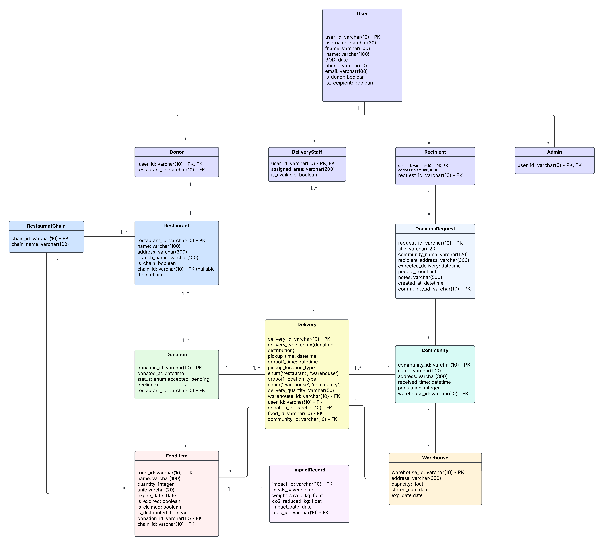

# 🍽️ ReMeals

> An integrated platform connecting food donors with communities to reduce food waste and improve food security.

[](https://opensource.org/licenses/MIT)
[](http://makeapullrequest.com)


## 🎯 About The Project

ReMeals bridges the gap between surplus food and those who need it most. By connecting restaurants, stores, and individual donors with community fridges and recipients, we're building a sustainable solution to food waste while maximizing social impact.

### The Problem

- Millions of tons of edible food waste annually
- Food insecurity affecting vulnerable communities
- Lack of coordination between donors and recipients

### Our Solution

A comprehensive platform that ensures food safety, tracks real-time inventory, coordinates volunteers, and measures environmental impact.

## ✨ Key Features

- 🏪 **Food Donation Management** - Restaurants and donors can easily log and track surplus food donations
- 📦 **Real-time Inventory Tracking** - Monitor food stock levels across community warehouses and fridges
- 🚚 **Smart Delivery Coordination** - Match available delivery staff with donation pickups and recipient deliveries
- 👥 **Recipient Network** - Connect households and community organizations with available food resources
- 📊 **Impact Analytics** - Track meals saved, food waste reduced, and CO₂ emissions prevented
- ✅ **Food Safety Compliance** - Automated expiry tracking and quality assurance workflows

## 🏗️ System Architecture

The platform manages multiple stakeholders:

| Role                     | Description                                                            |
| ------------------------ | ---------------------------------------------------------------------- |
| **Donors**               | Restaurants, chains, stores, and individuals contributing surplus food |
| **Recipients**           | Households and community organizations receiving food assistance       |
| **Delivery Staff**       | Volunteers coordinating food transport between locations               |
| **Community Warehouses** | Storage facilities managing inventory and distribution                 |
| **Administrators**       | Platform operators ensuring smooth operations                          |

## 📊 Database Schema



### Core Entities

- **User** - Base user account (donors, recipients, delivery staff, admins)
- **Donor** - Food donors linked to restaurants
- **Restaurant/RestaurantChain** - Food donor organizations
- **Donation** - Food donation records with status tracking
- **DonationRequest** - Requests from recipients/communities for food donations
- **FoodItem** - Individual food items with expiry and distribution tracking
- **Delivery** - Delivery coordination with pickup/dropoff times and status
- **DeliveryStaff** - Available volunteers with assigned areas
- **Recipient** - Recipients linked to communities
- **Community** - Recipient communities with demand tracking and warehouse assignment
- **Warehouse** - Storage facilities with capacity management and expiry tracking
- **ImpactRecord** - Environmental and social impact metrics (meals saved, CO₂ reduced)

### Key Relationships

- Users can be Donors, Recipients, DeliveryStaff, or Admins
- Donors are associated with Restaurants (which may belong to RestaurantChains)
- Donations contain multiple FoodItems
- Deliveries connect Donations with Recipients via DeliveryStaff
- Recipients belong to Communities, which have assigned Warehouses
- ImpactRecords track the environmental impact of distributed FoodItems

## 🚀 Getting Started

### Prerequisites

- Node.js >= 20.9 (for Next.js 16.0.3 and React 19.2.0)
- Python 3.12+ (for Django 5.2.8)
- PostgreSQL 16+ (or use Docker with PostgreSQL 16)
- Docker & Docker Compose (optional)

### Installation

1. Clone the repository

```bash
git clone https://github.com/NapatKulnarong/Re-Meals.git
cd Re-Meals
```

2. Follow the detailed setup instructions

For complete setup instructions, see the [Setup Guide](./docs/SETUP.md). The setup includes:

- Installing prerequisites (Node.js, Python, PostgreSQL)
- Configuring environment variables
- Setting up the database
- Installing backend and frontend dependencies
- Running migrations
- Starting development servers

**Quick Start with Docker:**
```bash
docker-compose up -d
```

**Or Local Setup:**
- Backend: See [SETUP.md - Local Setup](./docs/SETUP.md#method-2-local-setup)
- Frontend: See [SETUP.md - Frontend Setup](./docs/SETUP.md#step-4-frontend-setup)

### Using Docker

```bash
docker-compose up -d
```

#### Load the sample data with Docker

Once the services are running, you can populate the database with all of the fixtures in one shot:

```bash
docker compose exec backend python manage.py loaddata \
  fixtures/001_restaurant_chains.json \
  fixtures/002_restaurants.json \
  fixtures/003_warehouses.json \
  fixtures/004_communities.json \
  fixtures/005_users.json \
  fixtures/006_user_roles.json \
  fixtures/007_donations.json \
  fixtures/008_food_items.json \
  fixtures/009_donation_requests.json \
  fixtures/010_deliveries.json \
  fixtures/011_impactrecord.json
```

> Tip: run this command against a fresh database (or after `python manage.py flush`) to avoid duplicate-key errors while reloading fixtures.

### Test Users

After loading the sample data fixtures, the following test users will be available for testing different roles:

#### Administrator
| Field | Value |
|-------|-------|
| **Username** | `admin` |
| **Password** | `password123` |
| **Email** | admin@remeals.com |
| **Role** | System Administrator |
| **Name** | System Administrator |

#### Donors
| Username | Password | Email | Restaurant | Name |
|----------|----------|-------|------------|------|
| `donor1` | `password123` | findlay.kl@gmail.com | RES0000001 | Findlay Kline |
| `donor2` | `password123` | lili.byrd@gmail.com | RES0000003 | Lili Byrd |

#### Delivery Staff
| Username | Password | Email | Assigned Area | Name |
|----------|----------|-------|---------------|------|
| `delivery1` | `password123` | cordelia.ly@gmail.com | Bangkok Central | Cordelia Lynn |
| `delivery2` | `password123` | gideon.cu@gmail.com | Samut Prakan | Gideon Curry |

#### Recipients
| Username | Password | Email | Community | Name | Address |
|----------|----------|-------|-----------|------|---------|
| `recipient1` | `password123` | aston.me@gmail.com | COM0000001 | Aston Merritt | 123 Klong Toey, Bangkok 10110 |
| `recipient2` | `password123` | keeley.br@gmail.com | COM0000002 | Keeley Bradford | 456 Bang Khen, Bangkok 10220 |

## 📚 Documentation

Comprehensive documentation is available in the `/docs` directory:

- **[Setup Guide](./docs/SETUP.md)** - Detailed installation and setup instructions for local and Docker environments
- **[API Reference](./docs/API.md)** - Complete REST API documentation with endpoints, requests, and responses
- **[Architecture](./docs/ARCHITECTURE.md)** - System design, technology stack, and architectural decisions
- **[Development Guide](./docs/DEVELOPMENT.md)** - Contributing guidelines, code style, and best practices
- **[Testing Guide](./docs/TEST.md)** - Comprehensive testing guide for backend, frontend, and integration tests

For a quick overview of all documentation, see the [Documentation Index](./docs/README.md).

## 🛠️ Technology Stack

### Backend

- Python 3.12+ / Django 5.2.8
- Django REST Framework
- PostgreSQL 16 + pgAdmin 8.11

### Frontend

- Next.js 16.0.3 (React 19.2.0) — requires Node.js >= 20.9
- Tailwind CSS 4.1.17
- TypeScript 5.x

### DevOps

- Docker & Docker Compose
- GitHub Actions (CI)
- Dockerized Postgres services for local development

## 📁 Project Structure

```
remeals/
├── backend/
│   ├── community/
│   ├── delivery/
│   ├── donation/
│   ├── donation_request/
│   ├── fooditem/
│   ├── impactrecord/
│   ├── re_meals_api/
│   ├── restaurants/
│   ├── restaurant_chain/
│   ├── users/
│   ├── warehouse/
│   ├── manage.py
│   └── requirements.txt
│
├── frontend/
│   ├── app/
│   ├── components/
│   ├── public/
│   ├── package.json
│   ├── tsconfig.json
│   ├── tailwind.config.js
│   ├── next.config.ts
│   ├── eslint.config.mjs
│   └── package-lock.json
│
├── docs/
│   ├── API.md
│   ├── ARCHITECTURE.md
│   ├── DEVELOPMENT.md
│   ├── SETUP.md
│   ├── TEST.md
│   ├── db-diagram.png
│   └── README.md
│
├── .env.example
│
├── .github/
│   └── pull_request_template.md
│
├── .gitignore
│
├── CODE_OF_CONDUCT.md
│
├── CONTRIBUTING.md
│
├── docker-compose.yml
│
├── Dockerfile
│
├── LICENSE
│
├── README.md
│
└── SECURITY.md
```

## 🤝 Contributing

Contributions are what make the open source community amazing! Any contributions you make are **greatly appreciated**.

1. Fork the Project
2. Create your Feature Branch (`git checkout -b feat/amazing-feature`)
3. Commit your Changes (`git commit -m 'feat: add some amazing feature'`)
4. Push to the Branch (`git push origin feat/amazing-feature`)
5. Open a Pull Request

**Please read:**
- **[Contributing Guide](./CONTRIBUTING.md)** - How to contribute to the project
- **[Code of Conduct](./CODE_OF_CONDUCT.md)** - Our community standards
- **[Development Guide](./docs/DEVELOPMENT.md)** - Detailed development guidelines, code style, and best practices

### Commit Convention

We follow conventional commits:

- `feat:` - New features
- `fix:` - Bug fixes
- `docs:` - Documentation changes
- `refactor:` - Code refactoring
- `test:` - Adding tests
- `chore:` - Maintenance tasks

## 📈 Roadmap

- [x] Database schema design
- [x] UML diagram documentation
- [x] ER diagram documentation
- [x] User authentication system
- [x] Donation management interface
- [x] Real-time inventory tracking
- [x] Delivery coordination system
- [x] Impact analytics dashboard


## 🔒 Security

If you discover a security vulnerability, please **do not** open a public issue. Instead, please send an email to the project maintainers. See our [Security Policy](./SECURITY.md) for details.

## 📝 License

Distributed under the MIT License. See `LICENSE` for more information.

## 📧 Contact

- Karnpon Poochitkanon - karnpon14513@gmail.com
- Napat Kulnarong - kul.napat@hotmail.com
- Nisara Ploysuttipol - nisara.ploys@gmail.com
- Tanon Likhittaphong - 2005tanon@gmail.com

Project Link: [https://github.com/NapatKulnarong/Re-Meals](https://github.com/NapatKulnarong/Re-Meals)

## 🙏 Acknowledgments

- Food Rescue Organizations
- Community Partners
- All our volunteers and contributors

---

**ReMeals: Making a difference, one meal at a time.** 🍽️♻️

_If you find this project helpful, please consider giving it a ⭐!_
